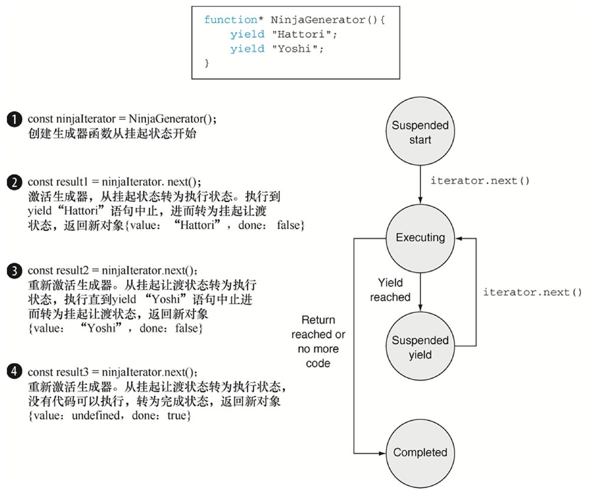
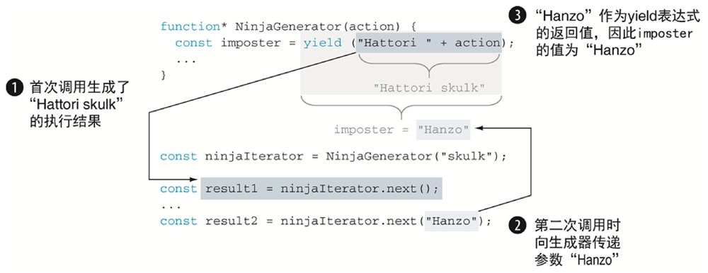
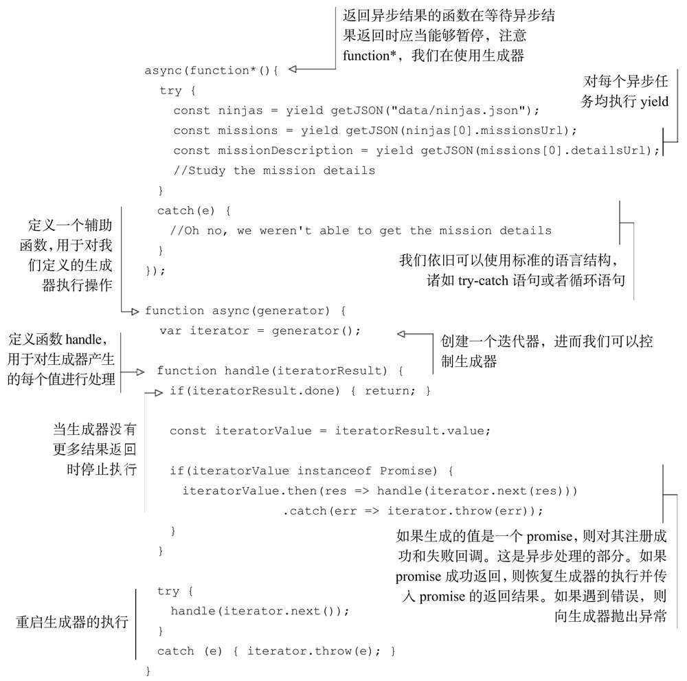

# Generators

_一句话解释_

> 提供一种生成 [Iterators](bear://x-callback-url/open-note?id=98D060BD-7904-4129-8808-120F53D9E1E6-789-00009DAB0E218DC0) 的便捷方式。

```text
function* idMaker() {
  var index = 0;
  while(true)
    yield index++;
}

var gen = idMaker();

console.log(gen.next().value); // 0
console.log(gen.next().value); // 1
console.log(gen.next().value); // 2
// ...
```








